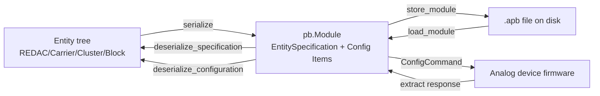

# Entity Object Representation

Hybrid-analog computers are complicated devices that combine analog circuitry
with digital electronics (microcontrollers). Seemingly simple operations, such
as setting a coefficient, require a large amount of steps to happen on the
device before the electrical components are configured as required. The goal
of the entity object model is to build a high-level abstraction over these
mechanics. Within the LUCIstack, `pybrid` occupies the `architecture` layer
in which users operate on the level of _components_ (a.k.a. _entities_) instead
of electrical switches. The firmware, the layer offering services to `pybrid`,
represents the microarchitectural level and turns configurations produced by
`pybrid` into actual realizations on the analog computer.

## Structure of the entity object representation

The main class is `pybrid.base.hybrid.entities.Entity`, where an entity is a
configurable object (a component with some dedicated function) in the
hybrid-analog device. Each entity has a _Path_ where the layout is roughly
`<Carrier MAC>/<Cluster ID>/<Block>[/{function}]`, with:

- `Carrier MAC` is the (unique) MAC address of the mREDAC or LUCIDAC board that
  houses the Teensy microcontroller.
- `Cluster ID` is either `0` for the LUCIDAC or one of `{0, 1, 2}` for mREDACs.
- `Block` is one of `{M0, M1, C, U, I, T, ST0, ST1, ST2, FP}` according to the
  functional unit.
- `function` is optional and can address individual entity parts, such as a
  single lane in the C-Block.

For more information on the hardware structure and how the paths above map to
physical components, refer to the section on
[hardware architecture](../hardware-architecture/index.md).

In order to retrieve the entity object model for a device, we connect to it and
let `pybrid` automatically create the model:

```python
import asyncio

from pybrid.redac.controller import Controller as REDACController

async def main():
    # connect to an anabrid device in your network
    controller = REDACController()
    await controller.add_device("<DEVICE IP>", 5732)

    # the `.computer` attribute then contains the entity object representation
    redac = controller.computer

    carrier = redac.carriers[0]
    cluster_1 = carrier.clusters[1]
    m0_block = cluster_1.m0block
    m0_block_entity = m0_block.entity_type

    print("Type:", m0_block_entity.type_)
    print("Version:", m0_block_entity.version)

    # continue to apply settings to the M0Block, e.g. an integrator's IC
    m0_block.elements[0].ic = -0.42
    # ...

if __name__ == "__main__":
    asyncio.run(main())
```

Each entity has a _type_ and a _version_, both stored in the device's EEPROM
and firmware. Behind the scenes, the model is constructed from the protobuf
messages the device sends to the client to describe its hardware (see below).
After configuration, via the process of _serialization_ (also covered below),
the entity object model's configuration is turned into a protobuf message and
sent to the device, where the firmware applies it to the hardware. This is the
preferred way of working with an analog computer: connect, retrieve the entity
object model, configure the model, serialize the configuration, apply it to
the analog computer, integrate, and receive results. It corresponds roughly to
assembly-level programming in the digital world. When going via the `redacc`
compiler, we do not need to go through `pybrid`'s entities; the compiler
implements its own entity representation and directly emits protobuf files.

## Relation to analog protobuf

anabrid's protobuf protocol (open-source, see
[`analog-protobuf`](https://github.com/anabrid/analog-protobuf)) contains all
possible messages exchanged with the analog devices. This includes the
configurations we send as part of the `ConfigureCommand`; a `message` is not
necessarily a message in the sense of being sent over the wire, but can also
translate to an _object_ in the object representation. More specifically,
configurations can be expressed as a `Bundle` containing `Items`, where each
`Item` carries the configuration for one functional block addressed by a path
(see above). The protocol therefore serves a dual purpose: it types the
communication messages between host and device, and it makes it possible to
store configurations (see the `File` message) to disk and exchange them.

### Specification vs. configuration

When looking at the `Items` in a `Module`, we generally distinguish between two
kinds of entry. An `EntitySpecification` carries the definition of an entity
(its type and address), and thereby dictates the hierarchical makeup of the
device. All other items carry configuration data. When referring to a
_specification_ inside a `Module`, we mean only the `EntitySpecifications`; the
remaining parts are called a _configuration_.

A _specification_ shows what hardware is present within an analog computer
(think, e.g., of M-blocks which can be freely exchanged) and what the hierarchy
of blocks is, including their types and versions. A _configuration_ states how
entities are configured, i.e. how their functions are set; in a C-block, for
example, this contains the coefficients the user has set. Both parts can be
combined into a single message, and in most cases you want to include the
specification alongside a configuration so the device can check it and report
changed hardware (e.g. when applying an old circuit). Specifications and
configurations can be retrieved separately with different flags to the
`pybrid extract` command.

### Serialization and deserialization

_Serialization_ in `pybrid` is the process of converting a populated entity
object representation (a tree of `Entity` instances, hanging off the
`AnalogComputer` / `REDAC` root) into a protobuf `Module` containing `Item`s,
where each `Item` either carries an `EntitySpecification` (the "what is there")
or a block-specific config message (`CoefConfig`, `ItorConfig`, `MDRConfig`,
...) addressed by an `EntityId.path`. _Deserialization_ is the inverse: take a
`Module` (loaded from disk, or received from a device after `extract`) and
either build the entity tree from scratch (when only `EntitySpecification`
items are present) or apply the configuration items onto an existing entity
tree.

Both operations live in the dedicated `protocol` subpackage of each device
family: REDAC uses `pybrid.redac.protocol.serializer` with `REDACSerializer`
and `REDACDeserializer`; LUCIDAC uses `pybrid.lucidac.protocol.serializer`
with `LUCIDACSerializer` and `LUCIDACDeserializer` (subclassing the REDAC
versions); the simulator's variants live under `pybrid.sim.protocol.serializer`.
Both classes use Python's `functools.singledispatchmethod` to dispatch on the
concrete entity / config type, so adding a new block usually means adding two
`@_serialize_configuration.register` / `@_deserialize_configuration.register`
methods (see the worked example below).



A typical end-to-end "configure → apply" workflow uses serialization
implicitly via a session:

```python
from pybrid.redac.controller import Controller as REDACController

async def main():
    controller = REDACController()
    await controller.add_device("<DEVICE IP>", 5732)

    async with controller:
        redac = controller.computer
        m0_block = redac.carriers[0].clusters[0].m0block

        # configure entities in-place
        m0_block.elements[0].ic = -0.42

        # the session serializes `redac` and sends a ConfigCommand
        await controller.create_session().set_config(redac).execute()
```

If you want to inspect or persist the serialized representation directly, use
the serializer class together with `ProtoIO`:

```python
from pybrid.redac.protocol.serializer import REDACSerializer
from pybrid.base.proto.io import ProtoIO

serializer = REDACSerializer()
module = serializer.serialize(redac)         # pb.Module
ProtoIO.store_module(module, "my_circuit.apb")
```

The reverse path uses the matching deserializer. Note that
`deserialize_configuration` requires the target entity tree to already exist;
the deserializer matches each `Item` to its entity via the path:

```python
from pybrid.redac.protocol.serializer import REDACDeserializer
from pybrid.base.proto.io import ProtoIO

module = ProtoIO.load_module("my_circuit.apb")
deserializer = REDACDeserializer(computer=redac)
deserializer.deserialize_configuration(module)
```

The `pybrid extract` CLI command is the shell-level equivalent of the above
and supports flags to limit the dump to specification only, configuration only,
or both (see the [protocol primer](./data-and-messaging-protocol.md)).

## Extending the representation

Because the entity object representation is a mapping between Python classes,
protobuf messages, and what the firmware understands, _extending_ the
representation always touches at least three layers: the Python entity class
plus its registration in `EntityType`, the (de)serialization handlers
translating between Python and protobuf, and the protobuf schema itself (and
the firmware on the device that consumes the new message). The MDR block
(`MMDRBlock`) is a recent addition and serves as a good worked example for
what each of those three steps looks like in practice.

### Worked example: the MDR block

The MDR block is a math block (M-block) whose four elements can each be
configured as one of `MULTIPLY`, `SQUARE`, `DIVIDE`, `SQRT`, `IDENT` — i.e.,
in addition to the per-element computation, the block needs a per-element
_operation type_ to be communicated to the firmware. The relevant locations in
the codebase are:

- **Entity class**:
  `packages/pybrid-computing/src/pybrid/redac/blocks/mblock.py` defines
  `MMDRBlock` next to `MIntBlock` and `MMulBlock`. It is registered via
  `@EntityType.register(EntityClass.MBLOCK, 3)` so a device reporting an
  M-block of `type=3` is automatically mapped to this class.
- **Computation type**:
  `packages/pybrid-computing/src/pybrid/redac/computations.py` introduces
  `MDROperation`, a `BaseComputation` whose `op` field holds one of
  `Multiplication | Square | Division | SquareRoot | Identity`.
- **Export**: the new class is re-exported from
  `packages/pybrid-computing/src/pybrid/redac/blocks/__init__.py` so the
  serializer and downstream code can import it from the package root.
- **Serializer**: in
  `packages/pybrid-computing/src/pybrid/redac/protocol/serializer.py` the
  `_serialize_configuration.register` handler for `MMDRBlock` builds a
  `pb.MDRConfig` by mapping each element's `op` instance to the matching
  enum value.
- **Deserializer**: the inverse handler in the same file dispatches on
  `pb.MDRConfig` and writes the corresponding
  `Multiplication() / Square() / ...` instance back into `entity.elements[i].op`.
- **Protobuf schema**: in the upstream
  [`analog-protobuf`](https://github.com/anabrid/analog-protobuf) repository,
  `MDRConfig` is defined with an `operations` field (`repeated Operation`) and
  an `Operation` enum (`MULTIPLY`, `SQUARE`, `DIVIDE`, `SQRT`, `IDENT`). The
  `Item` oneof was extended with an `mdr_config` field so a single `Item` can
  carry an MDR configuration.

### Adding a new block — step by step

When extending `pybrid` with a new (M-)block, you generally walk through the
same set of steps as above; the rough recipe is:

1. **Extend the protobuf schema** in the `analog-protobuf` repository. Add a
   new `<Block>Config` message describing the block's configuration payload
   (enums, lane lists, calibration data, ...) and extend the `Item` oneof
   (`kind`) with a new field referencing the new config message, picking an
   unused field number. Regenerate the Python bindings (`main_pb2.py`) and
   bump the protocol `Version`; if the change is backwards-compatible (a new
   optional field) increment the minor, otherwise major.
2. **Add a Python entity class** under
   `packages/pybrid-computing/src/pybrid/redac/blocks/`. Subclass `MBlock`
   (or `ElementBlock` for non-M blocks), declare `ELEMENTS` and `elements`
   with the appropriate `ComputationElement[...]` parametrization, and
   register it with `@EntityType.register(EntityClass.MBLOCK, <new_type_id>)`
   so the deserializer can map the entity tree reported by the device.
   Finally, re-export the class from `blocks/__init__.py`.
3. **If needed, add a computation type** in `computations.py` that captures
   the block's per-element configuration (e.g., a wrapper similar to
   `MDROperation`).
4. **Register serializer and deserializer handlers** in
   `redac/protocol/serializer.py`. Add one
   `@_serialize_configuration.register` for the new block class that creates a
   fresh `pb.Item` via `self.cc.new_config(entity)` and fills the new config
   field, and one `@_deserialize_configuration.register` for the new
   `pb.<Block>Config` message that locates the entity by path and writes the
   values back.
5. **Extend the firmware** so the device can consume the new `Item` kind. The
   firmware dispatches on the `Item.kind` oneof, applies the configuration to
   the actual hardware, and reports the block under the matching
   `EntityClass` / `type` / `version` triple when answering a
   `DescribeCommand`.
6. **Teach the compiler** (`redacc` / lucipy) about the new block, both for
   allocating the new resource type when mapping computations and for emitting
   the matching configuration items. Without this step the block is reachable
   only via direct entity-API use, not via the higher-level circuit
   description languages.
7. **Add tests** at the boundary: at minimum a round-trip test
   (`serialize → deserialize → compare`) for the new config, plus a device
   test behind the `device` marker once firmware support lands.
