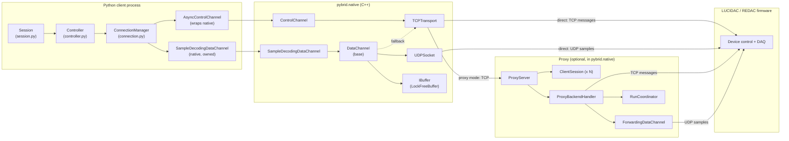

# Native Networking Code

This page covers how `pybrid` moves data between Python clients and analog
devices. The heavy lifting (sockets, buffers, channel state machines, the
proxy server) lives in `pybrid-computing-native`, the C++ extension. This
landing page conveys the architecture and intent; the two subpages drill
into the C++ details.

## Guiding principles

- **Sample rates dictate the design.** A single mREDAC streams up to 500k
  samples/s at 16 bit. With several carriers behind a proxy the aggregate
  wire rate is several MB/s of small UDP datagrams. The OS UDP receive
  buffer cannot be the only line of defence; it fills in milliseconds
  whenever any downstream stage stalls.
- **Devices stream over UDP, clients connect over TCP.** UDP is the only
  transport fast and loss-tolerant enough for sample streaming. TCP is
  the only transport that survives the variety of NAT/firewall setups
  client machines sit behind. The two never share a thread.
- **Decouple receive from forwarding via application-level queues.** The
  thread that drains a UDP socket never performs a TCP `send()` (which
  can block on `drain()` and stall reception). Cross-thread hand-off
  goes through an `IBuffer` queue in process RAM, allowed to grow until
  RAM is exhausted, at which point the connection is failed (not
  silently lossy).
- **Per-transport asio thread.** Every `UDPSocket`, `TCPTransport` and
  `TCPServer` owns its own `boost::asio::io_context` and one (or two)
  dedicated threads. Python asyncio never touches a socket directly.
  When sockets sat inside Python's event loop, a slow TCP `drain()`
  would block UDP reception and trip DMA overflow on the device.
- **GIL is released for every blocking native call.** Python wrappers
  hand off to native threads via `ThreadPoolExecutor(max_workers=1)` and
  release the GIL on `send` / `recv` / `start` / `stop`. The Python side
  stays responsive even when the C++ side is blocked.
- **UDP refusal as a first-class protocol step.** Clients always ask to
  stream over UDP. The recipient (device or proxy) may refuse, in which
  case the client transparently falls back to TCP on the existing
  control channel. The refusal is a protobuf message (not an
  out-of-band signal), so it round-trips cleanly through the proxy.
- **Time-share the device through the proxy.** Real LUCIDAC/REDAC
  hardware is single-tenant. Concurrency at the client level is solved
  by serialising at the proxy: one client is active at any time, others
  are queued and politely told `DeviceBusy` until their turn.
- **The proxy never spawns a thread per session.** All sessions live in
  a `std::deque<std::shared_ptr<ClientSession>>` and are driven by two
  fixed threads (frontend accept and worker dispatch) plus a reconnect
  thread for backends. Session destruction is deterministic, RAM stays
  bounded with respect to client count.
- **A session loop pumps the active session through a run.** The worker
  thread, together with `RunCoordinator` and `ProxyBackendHandler`,
  synchronises start / take-off / done across all backend devices
  before releasing the active session and admitting the next one.
- **Ping is special.** A standalone TCP ping (used for liveness checks)
  is handled by the proxy before a `ClientSession` is even constructed
  (`peek_for_ping()`), so it never consumes a backend slot and never
  makes a queued client wait.
- **Busy-wait belongs in C++.** The retry-on-busy loop lives in
  `ControlChannel::send_and_recv()`. Python clients never see the busy
  state; they see a single blocking call that succeeds once their slot
  is granted, or fails with a clear timeout.

## Architecture at a glance

The networking stack has three lanes (data, control, and client-facing) and
runs in one of two deployment modes (direct or proxy). The diagram below shows
the Python client process, the native C++ extension, the optional proxy, and
the device firmware.

- **Data lane (UDP).** Carries `RunDataMessage` samples from device to
  client (direct mode) or device to proxy (proxy mode). Always
  high-rate, always loss-tolerant.
- **Control lane (TCP).** Carries protobuf messages (config, start/stop,
  extract, auth, ping). Always reliable, ordered, low-rate.
- **Client lane (TCP via proxy).** In proxy mode the client speaks only
  TCP to the proxy; the proxy speaks UDP+TCP to the device on the
  client's behalf, forwarding samples back on the client's TCP
  transport.
- **Direct mode.** Client opens TCP control and UDP data sockets
  straight to the device; no proxy is involved.
- **Proxy mode.** Client opens a single TCP connection to the proxy;
  the proxy multiplexes one or more backend devices and serialises
  multiple clients into one active session at a time.

## Components

The C++ layers (buffers, transports, channels) are covered in depth on
[transport and channels](./native-networking/transport-and-channels.md);
the proxy is covered on [proxy server](./native-networking/proxy-server.md).
The remainder of this section sketches only the Python side of the
boundary, which lives entirely in `pybrid-computing`.

### Python boundary

The Python side of the boundary is intentionally thin: it consists of the
pybind11 module that exposes the native classes, an async wrapper that
releases the GIL on every blocking call, and a small set of Python-only
classes that orchestrate connection lifecycle and session execution.

- `pybind11` bindings
  (`packages/pybrid-computing-native/native/bindings.cpp`): expose
  `ControlChannel`, `SampleDecodingDataChannel`, `IBuffer` factory and
  transport helpers as the `pybrid.native` module.
- `AsyncControlChannel`
  (`packages/pybrid-computing/src/pybrid/redac/...`): wraps the native
  `ControlChannel`, exposes async `send_and_recv` and friends by offloading
  blocking native calls onto a single-thread executor and releasing the GIL.
- `DeviceConnection`
  (`packages/pybrid-computing/src/pybrid/redac/channel.py`): dataclass that
  holds the native `ControlChannel`, `SampleDecodingDataChannel`, and output
  `IBuffer` together. This is the unit `ConnectionManager` hands around.
- `ConnectionManager`
  (`packages/pybrid-computing/src/pybrid/redac/connection.py`): discovery,
  topology detection (direct vs proxy), and `DeviceConnection` lifecycle.
- `Session` (`packages/pybrid-computing/src/pybrid/redac/session.py`):
  deferred-command pipeline that buffers `SetConfigCommand`, `RunCommand` and
  others, then `execute()`s them under `controller._session_lock`. Drains
  decoded sample blobs from the output queue after the run completes.

## Drill-down

For the C++ details, two subpages drill into the layers introduced above:

- [Transport and channels](./native-networking/transport-and-channels.md):
  buffers, UDP/TCP transports, UDP→TCP fallback.
- [Proxy server](./native-networking/proxy-server.md): multi-client
  time-sharing, session loop, run coordinator.

## Related developer-guide pages

- [Place in the software stack](../overview/place-in-the-software-stack.md): where the networking stack sits in the LUCIstack picture.
- [Data and messaging protocol](./data-and-messaging-protocol.md): protobuf-on-TCP framing and message vocabulary.
- [Device object representation](./device-object-representation.md): what a `Carrier` or `Cluster` is when the controller talks about paths.
