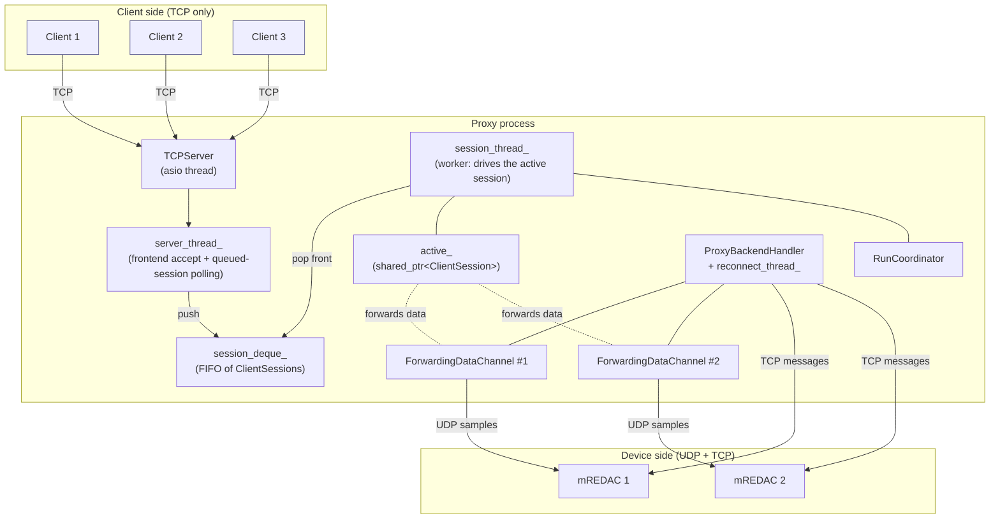
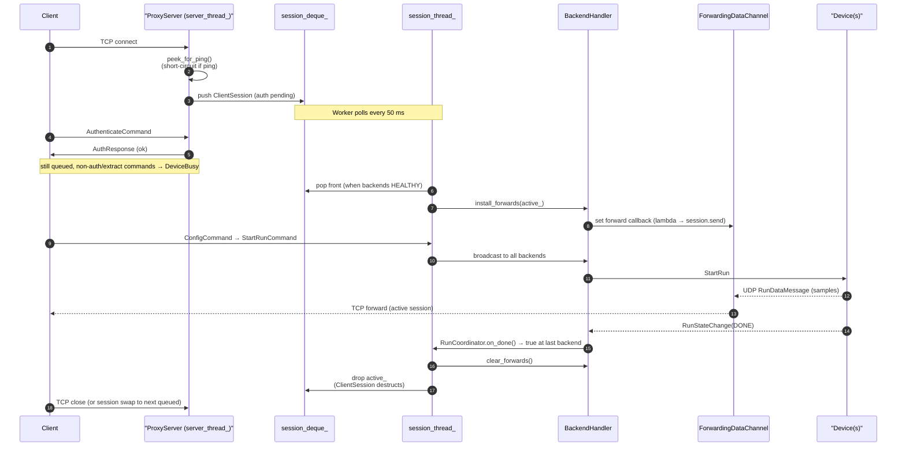

# Proxy server

The proxy time-shares a single-tenant LUCIDAC/REDAC device across multiple
clients, admitting one as "active" at a time and politely queueing the rest.
Clients always connect to the proxy over TCP only; the proxy in turn talks to
each backend device over UDP (for samples) and TCP (for control). This page
covers the C++ machinery in `packages/pybrid-computing-native/native/pybrid/proxy/`
that makes this work. For the transport and channel layers it builds on, see
[`./transport-and-channels.md`](./transport-and-channels.md).

## Why a proxy

Real LUCIDAC/REDAC hardware is single-tenant: only one client may drive a
device at any given time. Clients need a TCP-only ingress because real client
machines sit behind NAT and firewalls of every shape, and UDP does not survive
them reliably. The proxy-to-device path stays on UDP so the DMA-fed sample
stream never has to compete with a slow client `drain()` (the OS UDP receive
buffer is too small to absorb a stall). A single proxy endpoint can also
aggregate several backend mREDACs behind one TCP address, hiding the topology
from clients.

## Architecture

The proxy process owns one `TCPServer` for client accepts, two long-lived
worker threads, and a backend handler that aggregates one or more device
connections. All `ClientSession`s live in a single `std::deque` and are
driven by fixed threads, not by per-session threads. At most one session is
"active" at any time; the rest are queued and receive `DeviceBusyMessage`
until promoted.

Client TCP connections terminate at the proxy's `TCPServer`; nothing on the
client side speaks UDP. The `server_thread_` accepts new connections and
pushes `ClientSession`s onto `session_deque_`, while also polling queued
sessions to keep them alive. The `session_thread_` (worker) pops the front
session into `active_` once the backends are healthy and drives it through
one full run. `ProxyBackendHandler` owns the backend devices and the
`ForwardingDataChannel`s; it wires the active session in and out via
`set_active_session()`. Each `ForwardingDataChannel` runs on its own
backend-side asio thread and forwards `RunDataMessage`s to the active
client's TCP transport. `RunCoordinator` synchronises take-off and DONE
across all backends so the worker only releases the active session when the
run is fully complete.

## Threading model

### `server_thread_` (frontend)

The frontend thread runs `TCPServer::accept(0.1s)` in a loop on the listening
socket. On every accepted socket it calls `peek_for_ping()` before any
`ClientSession` is constructed; a pure ping is replied to and the connection
closed. Otherwise it constructs a `ClientSession` (with an optional pending
first-message buffer if a non-ping frame was already peeked) and pushes it
onto `session_deque_`. It also polls all queued (non-active) sessions in
`poll_queued()`: draining pending messages on each session's TCP transport,
replying with `DeviceBusyMessage` to every command that is not auth or
extract, and erasing sessions whose TCP transport has disconnected.

### `session_thread_` (worker)

The worker polls `session_deque_` every 50 ms (`WORKER_POLL_INTERVAL`) and
waits for all backends to be `HEALTHY` before popping the front session into
`active_` (the proxy's one active-session slot, a
`shared_ptr<ClientSession>`). It then calls
`ProxyBackendHandler::install_forwards(active_)` to wire the forwarding
callbacks for every `ForwardingDataChannel`, drives the active session
through one run (config, start, sample forwarding, DONE), tears down the
forwards (`clear_forwards()`), and finally drops `active_` under
`deque_mutex_` so `ClientSession` destruction is deterministic.

### `reconnect_thread_`

This thread is owned by `ProxyBackendHandler`, not by `ProxyServer`. It
re-establishes connections to disconnected backends and flips their health
state back to `HEALTHY` on success. The session thread observes the health
state on its next 50 ms tick and resumes promoting queued sessions.

### Why this structure

This layout avoids one thread per session, which was the root of the
memory-leak incident on 2026-04-24 (every queued client kept a stack alive).
`ClientSession` lifetime is deterministic: the destructor runs at the exact
point `active_` is reset under `deque_mutex_`, so resources do not leak into
the next session's run. The fixed thread count means RAM usage is bounded
with respect to the number of clients.

## Components

### `ProxyServer`

`ProxyServer` (in
`packages/pybrid-computing-native/native/pybrid/proxy/proxy_server.h` and
`proxy/proxy_server.cpp`) owns the frontend `TCPServer` and the two worker
threads, holds `session_deque_` and the `active_` pointer under
`deque_mutex_`, dispatches incoming protobuf messages on the active session
to the handlers in `proxy_message_handlers.cpp`, and enforces authentication
(every non-auth, non-extract command on a non-authenticated session is
rejected).

### `ClientSession`

`ClientSession` (in `proxy/proxy_session.h`, `proxy/proxy_session.cpp`) holds
the per-client state: a UUID identifying the session in logs and
instrumentation, the `TCPTransport` owned by this session, the
`authenticated` flag, the `done_received` flag (used by the worker to detect
end-of-run), a pending first-message buffer (populated when
`peek_for_ping()` consumed a non-ping frame during accept), and
instrumentation counters (`alive_count`, `alive_peak`) tracking how many
sessions are alive concurrently.

### `ProxyBackendHandler`

`ProxyBackendHandler` (in `proxy/proxy_backend_handler.h`,
`proxy/proxy_backend_handler.cpp`) owns the `backends_` vector of backend
device connections and maintains `path_to_backend_`, mapping device entity
paths to the backend that hosts them. It also owns the `reconnect_thread_`
and the per-backend health state, and exposes
`set_active_session(weak_ptr<ClientSession>)` so the worker can wire and
unwire the active session against every `ForwardingDataChannel`. For
commands that must reach all backends (start run, reset, ...), it provides
`broadcast_to_backends()`.

### `ForwardingDataChannel`

`ForwardingDataChannel` (in `proxy/forwarding_data_channel.h`,
`proxy/forwarding_data_channel.cpp`) is a subclass of `DataChannel` (see
[transport and channels](./transport-and-channels.md)) that overrides
`handle_data_message`. It intercepts `RunDataMessage`s on the backend's own
asio thread (one channel per backend) and invokes the `m_forward` lambda,
which calls `session.send(msg)` on the active `ClientSession`'s TCP
transport to forward the sample frame to the client. The lambda captures
`weak_ptr<ClientSession>` and `lock()`s it before sending; if the active
session has been dropped, the message is discarded (no dangling reference).
The channel also tracks per-carrier sequence numbers so the client sees a
contiguous stream even with multiple backends.

### `RunCoordinator`

`RunCoordinator` (in `proxy/proxy_run_coordinator.h`,
`proxy/proxy_run_coordinator.cpp`) implements a per-run barrier across all
backends. Its internal state is `run_id_`, `take_off_count_`, and
`done_count_`. `on_done()` returns true only at the last backend's DONE
message, signalling the worker that the run is finished and the active
session may be released.

### Message dispatch (`proxy_message_handlers.cpp`)

`proxy/proxy_message_handlers.cpp` contains pure routing logic with no
thread management or lifetime decisions. The per-protobuf-field handlers
are `handle_reset`, `handle_config`, `handle_extract`, `handle_start_run`,
`handle_update`, and `handle_auth`, plus the remaining command handlers
covered by `ProxyServer`'s dispatch.

## Lifecycle of a client run

The same picture as the static view above, but ordered in time. This is what
one client looks like as it joins the proxy, waits its turn, runs, and leaves.

The accept thread peeks the first frame; a pure ping returns immediately
without ever creating a `ClientSession`, so liveness probes do not consume a
queue slot. The new `ClientSession` is pushed to the back of `session_deque_`
and remains there until the worker promotes it; meanwhile the
`server_thread_` keeps it alive by draining its inbox and replying
`DeviceBusy` to non-auth and non-extract commands. The worker only promotes
the front session once every backend reports `HEALTHY`;
`install_forwards(active_)` then wires the active session into every
`ForwardingDataChannel`. During the run, sample frames travel over UDP from
each device into its `ForwardingDataChannel`, which immediately forwards them
over the active session's TCP transport (one hop, two threads in flight).
When `RunCoordinator::on_done()` returns true at the last backend's DONE, the
worker tears down the forwards and drops `active_`; dropping `active_` runs
the `ClientSession` destructor under `deque_mutex_`, and the worker's next
tick then picks up the next queued session, if any.

## Special cases

### Ping

Ping is handled by `peek_for_ping()` on the `server_thread_` immediately
after `accept`, before a `ClientSession` is constructed. A pure ping is
replied to and the socket is closed, so no session slot is consumed and
queued clients are not blocked or starved by liveness probes.

### Busy-wait

The retry-on-busy loop lives in C++ inside `ControlChannel::send_and_recv`,
not at the proxy level. Queued clients receive a `DeviceBusyMessage` from
`poll_queued()` for every non-auth, non-extract command they send, and their
`ControlChannel` retries internally; Python callers therefore see a single
blocking call that succeeds once their slot is granted, or fails with a
clear timeout.

### Backend reconnect

`reconnect_thread_` keeps trying to reconnect any backend that has fallen
into the unhealthy state. The worker checks backend health on its 50 ms
tick and only promotes a queued session once all backends are `HEALTHY`
again. An in-flight active session whose backend disconnects is aborted;
the client sees a normal channel error via the `on_error` path of its
`ControlChannel`.

## UDP / TCP asymmetry

Clients never enable UDP when behind a proxy: the controller checks a
`behind_proxy=True` flag and short-circuits `enable_udp()`. The proxy
negotiates UDP with the device on the client's behalf and forwards the
resulting samples back over the client's TCP transport. This is the rule
that prevents the receiving thread (backend asio) from ever also being the
forwarding thread (client TCP `send`); each socket keeps its own dedicated
thread.

## See also

- [Native networking landing page](../native-networking-code.md) for the
  full architecture overview and the Python boundary.
- [Transport and channels](./transport-and-channels.md) for the buffer,
  transport, and channel layers (including `DataChannel`, which
  `ForwardingDataChannel` extends).
- [Proxy mode (user guide)](../../user-guide/using-pybrid/proxy.md) for the
  user-facing "how to run a proxy".
