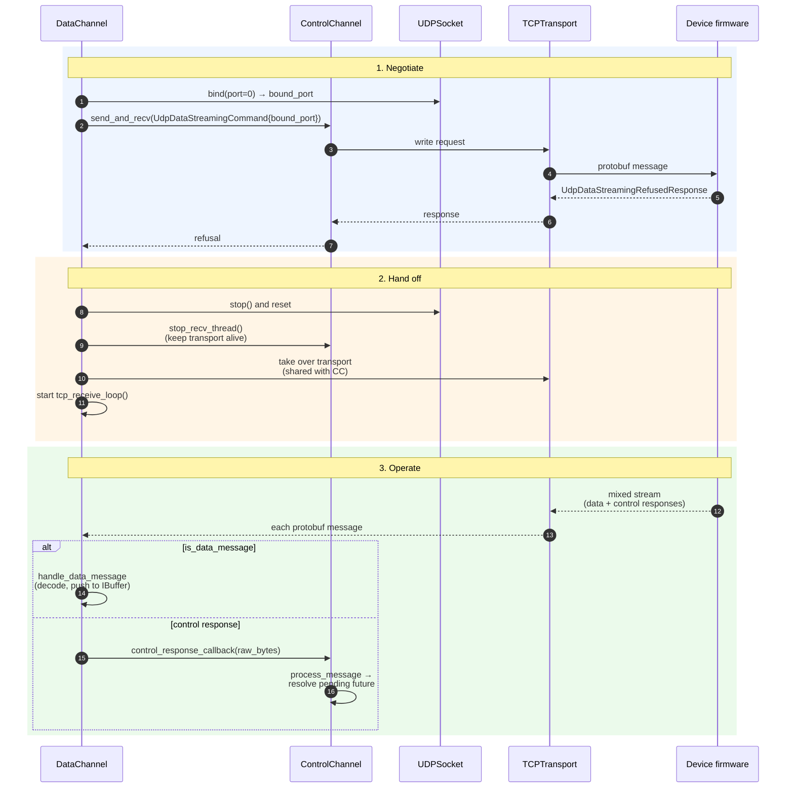

# Transport and channels

This subpage covers the C++ machinery that moves bytes between the device
and either a direct client or the proxy. It assumes the [landing
page](../native-networking-code.md) has been read, including the guiding
principles (per-transport asio thread, application-level queues, UDP
refusal as a first-class step). Everything described here lives under
`packages/pybrid-computing-native/native/pybrid/`.

## Buffers and queues

OS socket buffers cap out at a few hundred kB, while a single mREDAC can stream
multi-MB/s of small UDP datagrams; the kernel buffer cannot be the only line
of defence. Application-level queues move the stall into RAM (observable,
measurable, fails loud) so packets are not silently dropped at the kernel.
They also decouple the asio thread that drains a socket from the thread that
forwards or decodes; without that decoupling, a slow TCP `drain()` would stall
UDP reception.

### Interface and implementation

The buffer machinery is built around an abstract interface, one production
implementation, and a factory:

- `IBuffer` (`packages/pybrid-computing-native/native/pybrid/buffer.h`) is the
  abstract surface used by every transport and channel. It exposes `put`,
  `try_put`, `get`, `len`, and `size`, and defines two error types:
  `BufferFullError` (currently disabled in unbounded mode) and
  `MessageTooLargeError`. `try_put` fails on `MessageTooLargeError` only; the
  queue itself grows unbounded.
- `LockFreeBuffer<SLOT_DATA_SIZE, INITIAL_CAPACITY>`
  (`packages/pybrid-computing-native/native/pybrid/lockfree_buffer.h`) is the
  production implementation: an MPMC lock-free queue with fixed-size slots,
  where `INITIAL_CAPACITY` is a sizing hint and the queue grows on demand.
  It is lock-free because producer and consumer are different OS threads and
  a mutex on the hot path would re-couple them.
- `BufferFactory`
  (`packages/pybrid-computing-native/native/pybrid/buffer_factory.h`) is the
  single entry point that hands `unique_ptr<IBuffer>` to transports and
  channels.

### Ownership and threading

The producer is the transport's own asio I/O thread, which is a single writer
per queue in practice. The consumer is the channel or forwarding thread (one
of `recv_thread_`, `m_receive_thread`, or the proxy worker). No mutex sits on
the hot path; correctness rests on the lock-free queue's memory ordering.

## Transport layer

### Common interface

`ITransport` (`packages/pybrid-computing-native/native/pybrid/transport.h`) is
the common surface for every concrete transport, with `start`, `stop`, `recv`,
and `send`. `RecvResult` carries a `RecvStatus` enum (`Success`, `Timeout`,
`Disconnected`); `Timeout` is a normal polling result that callers loop on,
and `Disconnected` is terminal and propagates through `on_error` on the
owning channel. Every concrete transport owns its own `boost::asio::io_context`
and one (or two) dedicated threads; Python's asyncio loop never touches a
socket directly.

### UDP — `UDPSocket`

`UDPSocket` lives in
`packages/pybrid-computing-native/native/pybrid/transport/udp_socket.h` (impl
in `udp_socket.cpp`) and handles datagram bind plus send and recv for sample
streaming from the device. A single asio thread drains the kernel buffer and
pushes datagrams into the internal `IBuffer`, so `recv()` is a queue dequeue,
not a syscall, which keeps the receive path off the I/O thread. Construction
goes through three methods: `bind(local_port)` binds (pass `0` to let the OS
pick a port and read it back), `connect(remote_endpoint)` optionally fixes the
peer so later `send` calls do not need a destination, and
`send_to(remote_endpoint, bytes)` is used in unconnected mode.

### TCP — `TCPTransport`

`TCPTransport` lives in
`packages/pybrid-computing-native/native/pybrid/transport/tcp_transport.h`
(impl in `tcp_transport.cpp`) and exposes a varint-length-prefixed protobuf
message stream. It runs two threads (one io thread for `recv` and a send pump
for `send`), so `send()`-side back-pressure does not leak into the recv path.
There are two construction modes: `connect(host, port)` for outbound client
connections and `from_accepted(AcceptedSocket)` for inbound connections (used
by the proxy and the test fixture). The per-message frame limit is
`DEFAULT_TCP_MESSAGE_SIZE` = 262 kB.

### TCP listening — `TCPServer` and `AcceptedSocket`

`TCPServer` (in
`packages/pybrid-computing-native/native/pybrid/transport/tcp_server.h`, impl
in `tcp_server.cpp`) runs the accept loop and yields `AcceptedSocket` values
(in `accepted_socket.h`) on each new connection. `AcceptedSocket` is a
move-only fd holder; ownership is transferred directly to
`TCPTransport::from_accepted`. It is used by `ProxyServer`
(see [proxy server](./proxy-server.md)) and by the `DummyDAC` test fixture.

### Diagnostics

Both transports expose drop counters: `UDPSocket::stats()` returns a `UDPStats`
with `packets_dropped`, and `TCPTransport::stats()` returns a `TCPStats` with
`messages_dropped`. Non-zero drop counters indicate the application-level
queue is not keeping up with the wire rate; use them to diagnose forwarding
or decoding stalls.

## Channel layer

### `ControlChannel`

`ControlChannel` (in
`packages/pybrid-computing-native/native/pybrid/channel/control_channel.h`,
impl in `control_channel.cpp`) is the protobuf message channel on top of a
single `TCPTransport`, carrying control traffic (config, start/stop, extract,
auth, ping). A single `recv_thread_` runs `recv_loop()`, which parses incoming
protobuf messages, resolves pending `send_and_recv` futures by UUID, and
dispatches fire-and-forget callbacks. `send_and_recv(msg, timeout)` blocks the
caller until the response arrives or the timeout expires. The busy-wait retry
loop is held internally: a `DeviceBusyMessage` triggers a transparent retry,
so Python sees a single blocking call that either succeeds when its slot is
granted or fails with a clear timeout.

### `DataChannel` (base)

`DataChannel` (in
`packages/pybrid-computing-native/native/pybrid/channel/data_channel.h`, impl
in `data_channel.cpp`) handles streaming receive plus the UDP/TCP negotiation
choice. It owns its own `UDPSocket` and can borrow the associated
`ControlChannel`'s `TCPTransport` under fallback (see below). One
`m_receive_thread` runs either `udp_receive_loop()` or `tcp_receive_loop()`
depending on the outcome of negotiation at `start()` time. Three callbacks are
exposed to consumers: `on_run_state_change(state)` for run lifecycle events,
`on_error(err)` for terminal transport or decode failures, and
`set_control_response_callback(cb)`, which is the hook used under TCP
fallback to forward demuxed control responses back to `ControlChannel`.

### `SampleDecodingDataChannel`

`SampleDecodingDataChannel` (in
`packages/pybrid-computing-native/native/pybrid/channel/sample_decoding_data_channel.h`,
impl in `sample_decoding_data_channel.cpp`) is the concrete subclass of
`DataChannel` that decodes incoming protobuf `DaqData` messages. It applies
per-channel gain and offset, reshuffles into column-major order, and packages
the result as a `DecodedSampleBlob`. The `DecodedSampleBlobHeader` layout, in
order, is `entity_path_len`, `sample_count`, `channel_count`, `sample_type`,
`chunk_number`, `has_probes`. `set_output_queue(buffer)` plugs the destination
`IBuffer`; Python drains the queue after the run completes. The blob layout
is designed for zero-copy `numpy.frombuffer` on the Python side; decoding
stays in C++ to avoid GIL-bound bottlenecks at line rate.

## UDP to TCP fallback

This section walks through what happens when UDP data streaming is
refused by the device (or by the proxy on the device's behalf). The
end state is a single TCP connection that carries both control traffic
and sample data, with the `DataChannel` reading directly from the
transport that `ControlChannel` opened.

### What the sequence shows

The diagram below tracks one full negotiation and switchover, from
`DataChannel::start()` deciding to attempt UDP, through the refusal, to the
steady-state TCP-only operation. It is the only situation in the system where
two channels share one transport, so it is worth understanding step by step.

### Participants

Five actors are involved in the negotiation: `DataChannel` (`DCh`) wants to
receive samples and tries UDP first, falling back to TCP if UDP is refused;
`ControlChannel` (`CC`) owns the only `TCPTransport` to the device and
normally drives it from its own `recv_thread_`; `UDPSocket` (`US`) is the
candidate data socket that `DataChannel` opens before negotiation and
releases on fallback; `TCPTransport` (`TT`) is the single TCP connection to
the device, owned by `ControlChannel` and shared with `DataChannel` after
fallback; and `Device firmware` (`FW`) accepts or refuses UDP streaming and
emits the data stream afterwards.

### Phases

The handover proceeds in three phases. In the **negotiate** phase,
`DataChannel` binds a local UDP port, asks the device via the control channel
whether it may stream there, and receives a refusal. In the **hand off**
phase, `DataChannel` tears down its UDP socket, pauses `ControlChannel`'s
receive loop, and takes over the TCP transport. In the **operate** phase, the
device sends a single TCP stream mixing data and control responses;
`DataChannel` demuxes each message and routes control responses back to
`ControlChannel`.

### Step-by-step walk-through

In the **negotiate** stage (steps 1–7), `DataChannel::start()` binds
`UDPSocket` on a free local port and uses `ControlChannel::send_and_recv` to
ask the device to stream there. The request travels over `TCPTransport` as one
varint-framed protobuf message. The device replies with
`UdpDataStreamingRefusedResponse`, and the reply is delivered back to
`DataChannel` as the return value of `send_and_recv`.

In the **hand off** stage (steps 8–11), because UDP is unavailable,
`DataChannel` stops and discards its `UDPSocket`. It then calls
`ControlChannel::stop_recv_thread()`, which parks the control receive loop
while leaving `TCPTransport` running. `DataChannel` captures the transport
pointer and launches its own `tcp_receive_loop()` on it.

In the **operate** stage (step 12 onwards), the device writes data messages
and occasional control responses onto the same TCP socket. `DataChannel`'s
loop reads each message and asks `is_data_message()`. On the `alt` branch
(yes), the message is handled in place by `handle_data_message()`, which
decodes samples and pushes a `DecodedSampleBlob` into the output `IBuffer`.
On the `else` branch (no), the raw bytes are passed to `ControlChannel` via
`set_control_response_callback`, which feeds them into the same
`process_message` path the recv loop would have used.

### Notes

`ControlChannel::stop_recv_thread()` only pauses the control receive thread;
the underlying `TCPTransport` keeps running so `DataChannel` can keep reading
from it. Sends from `ControlChannel` (e.g. follow-up `send_and_recv` calls)
remain unaffected, because the send pump and the recv loop are separate
threads on the same transport. When the run ends, `DataChannel` releases the
shared transport and `ControlChannel::start_recv_thread()` resumes normal
control message handling.

## Wire framing — quick reference

On UDP, every protobuf message occupies one datagram, capped at
`MAX_UDP_PACKET_SIZE` = 64 kB. On TCP, each protobuf message is preceded by
its varint-encoded length, with a per-message cap of
`DEFAULT_TCP_MESSAGE_SIZE` = 64 kB. Deeper protocol semantics (message
vocabulary, command/response pairing) live in the
[data and messaging protocol](../data-and-messaging-protocol.md) page.

## See also

- [Landing page](../native-networking-code.md) for the cross-language
  architecture and the Python boundary.
- [Proxy server](./proxy-server.md) for how `ControlChannel`, `DataChannel`,
  and `TCPServer` are wired together to time-share a single-tenant device
  across multiple clients.
- [Data and messaging protocol](../data-and-messaging-protocol.md) for the
  protobuf framing and message vocabulary used over both transports.
