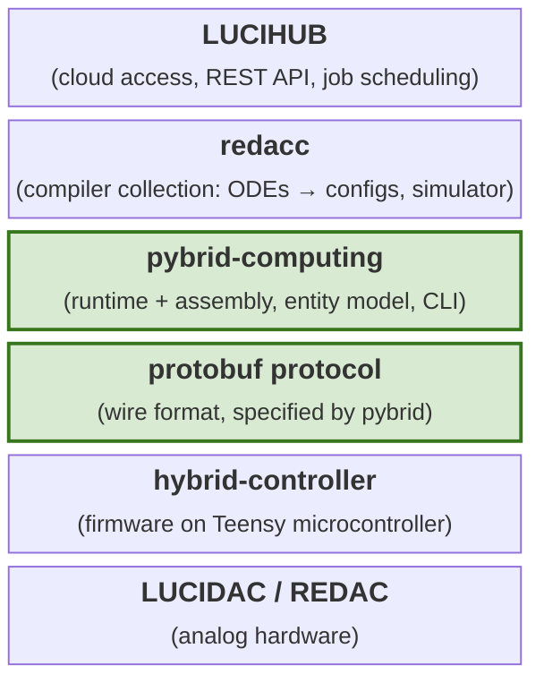
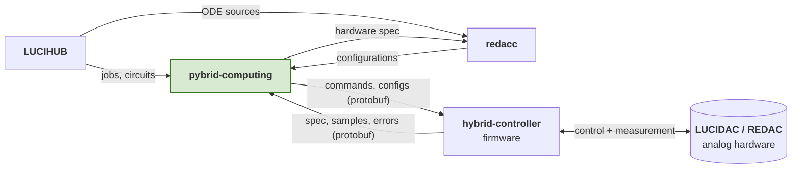

# Place in the software stack

anabrid's software covers analog computing end to end, from the firmware
that runs on the device all the way up to a cloud infrastructure for
remote operation. The guiding idea is to turn analog computers into
"mathematical machines": the immanent complexity of wiring summers,
integrators, and multipliers is hidden from anyone who does not want to
see it, while users who do want direct access can still reach down to
the level they need. To make that possible, each layer of the stack
exposes its own interface, and users enter at whichever layer matches
their use case.

This software stack has been christened LUCISTACK and is covered by its own
[documentation](https://anabrid.github.io/lucistack/) which outlines all the
layers in the stack and their used abstractions. This page only recaps the necessary
context to understand `pybrid`'s function in the stack.

The green bricks mark the two layers that this package owns: the runtime
and the wire protocol it speaks to the device. Everything below them is
hardware and firmware; everything above them is built on top of
`pybrid`, sometimes alongside the compiler.

## The layers, from bottom to top

The **analog hardware**, `LUCIDAC` and `REDAC`, is the physical
machine. A `LUCIDAC` is the smallest reconfigurable device in anabrid's
line-up, while a `REDAC` scales the same ideas across multiple carrier
boards. Both present the same logical structure of carriers, clusters
and blocks to the layers above, which is what lets a single software
stack drive either of them through one model.

The **`hybrid-controller`** is the device firmware. It runs on each
mREDAC's "HybridController", a microcontroller of the
[Teensy](https://www.pjrc.com/teensy/) family, and is the only piece of
software that touches the analog hardware directly. It accepts commands
and configurations from a host over the protobuf protocol and, in
return, streams back samples and error messages. The firmware is not
open source today; its public interface is the protocol described next.

The **protobuf protocol** is the wire format between the firmware and
any host. Its full specification lives in this repository (see
[Data and messaging protocol](../developer-guide/data-and-messaging-protocol.md))
and is implemented in `pybrid` through a set of small Python
abstractions. The specification itself is language-neutral, so any
client that follows it can operate the device regardless of the
language it is written in. That is what keeps the lower half of the
stack open even while the firmware remains closed.

The **`pybrid-computing`** package, this project, is the runtime and
assembly layer. It de/serialises between protobuf-formatted
configurations and a Python object model, drives the connection to one
or more devices, and exposes the `pybrid` CLI. It also implements the
"SuperController" that coordinates multiple carriers in a `REDAC`. The
two concepts `pybrid` covers are discussed in more detail
[below](#what-pybrid-contributes).

The **`redacc`** compiler collection is anabrid's LLVM + MLIR-based
toolchain for analog devices. Given a system of ODEs written in
analang, it emits a configuration for any of anabrid's reconfigurable
computers. `redacc` also ships a simulator that replays a configuration
mathematically, so users can verify their circuits without a physical
device in the loop.

Finally, **`LUCIHUB`** is the cloud-based access system. It fronts one
or more physical devices behind a REST API and a distributed,
worker-based scheduler with a central database for jobs and users.
`LUCIHUB` uses `pybrid` and `redacc` internally, which means it accepts
both ready-made circuits and ODE descriptions submitted by its clients
and feeds them through the same lower layers as any local user would.

## How the parts talk to each other

The relationships between these components are easier to see as a
graph. The arrows below capture what flows across each interface; edges
labelled `(protobuf)` are the ones defined by this package's wire
protocol, while the rest are ordinary Python or REST calls.

- `pybrid` ↔ firmware runs entirely over the protobuf protocol: `pybrid`
sends configurations and commands, the firmware answers with the
device's own hardware specification, samples, and error reports.
- `pybrid` ↔ `redacc` is a two-way Python interface. `pybrid` hands the
compiler a hardware specification (so `redacc` knows what the target
can actually do), and `redacc` hands back a configuration compiled from
an ODE system.
- `LUCIHUB` also consumes both, but at the service level: it accepts
circuits from its REST clients and routes them through `pybrid` to a
device, or routes ODE sources through `redacc` first and then the same
way down.

## What `pybrid` contributes

`pybrid` combines two concepts that are familiar from digital computing
stacks: a **runtime** and an **assembly** layer. Both remain useful
even when `pybrid` is not the top-level interface into the device.

- The runtime side is the
[data and communication protocol](../developer-guide/data-and-messaging-protocol.md).
It uses Google's protobuf framework on the wire and a small set of
Python abstractions on top, but the specification itself is
language-neutral: any implementation that matches it can drive the
device without `pybrid` in the loop.
- The assembly side is the
[entity object representation](../developer-guide/device-object-representation.md).
`pybrid`'s `Serializer` takes a hardware specification sent back by the
device and turns it into a Python object tree that mirrors the
`REDAC`'s architectural layout (carriers, clusters, blocks, lanes).
Modifying that tree is how users build configurations at the lowest
programmable level the device exposes, short of writing protobuf
messages by hand.

Everything higher up in the stack (`redacc`, `LUCIHUB`)
is optional, and everything lower down (firmware, hardware) is absolutely required 
for operating the analog computer.
`pybrid` is the narrow waist that the rest of the stack relies on, and
the layer users reach for when they want to address the hardware
directly.
